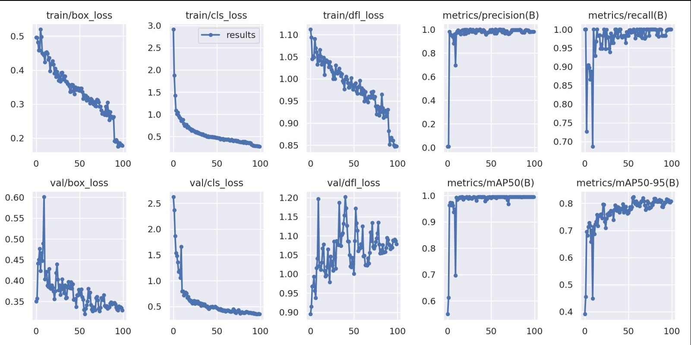
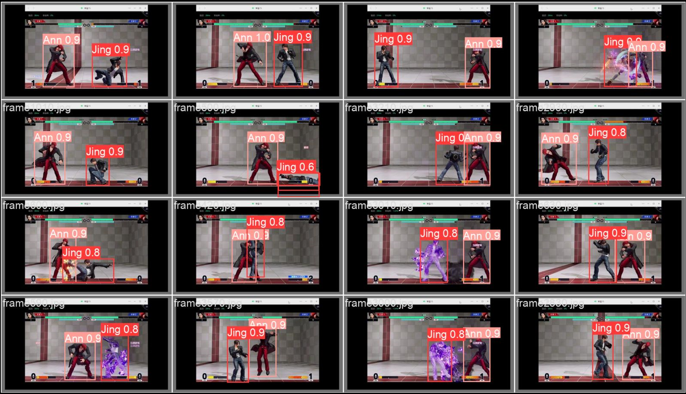

We captured in-game images and meticulously annotated approximately 1000 pictures using the Labelme tool, annotating both positional information and task-oriented actions. This dataset was subsequently partitioned into training, validation, and test sets in an 8:1:1 ratio. Leveraging the YOLOv8 pre-trained model, our training process spanned 150 epochs, resulting in an impressive 99% accuracy on the test set. The computational power for this endeavor came from an Intel Core i7 12700F processor paired with an NVIDIA RTX 3060ti graphics card, which proved instrumental in both the training and testing phases.

We implemented a custom environment class using the OpenAI Gym library, where we not only rewrote relevant functions but also introduced additional features such as image information extraction. The environment offers a rich set of interfaces for easy integration and customization. Users can effortlessly tailor the functionality to their specific needs by modifying the relevant Python files.

While we've pre-defined actions for the agent, it's worth noting that in the context of the King of Fighters (KOF) game, our defined moves may not encompass all possible actions. This observation emphasizes the dynamic and diverse nature of in-game scenarios, prompting us to acknowledge the need for ongoing refinement and expansion of the predefined agent actions to ensure a more comprehensive and adaptable reinforcement learning framework.

At present, our system supports agent control of Kyo Kusanagi, engaging in battles against the computer-controlled Iori Yagami. Looking ahead, our aspiration is to extend the capabilities to facilitate scenes where two agents engage in combat. The realization of dual-agent battles may necessitate enhanced computational resources, potentially requiring more advanced graphics cards for optimal performance and efficiency. This expansion is anticipated to bring about more complex and nuanced interactions within the King of Fighters game environment.