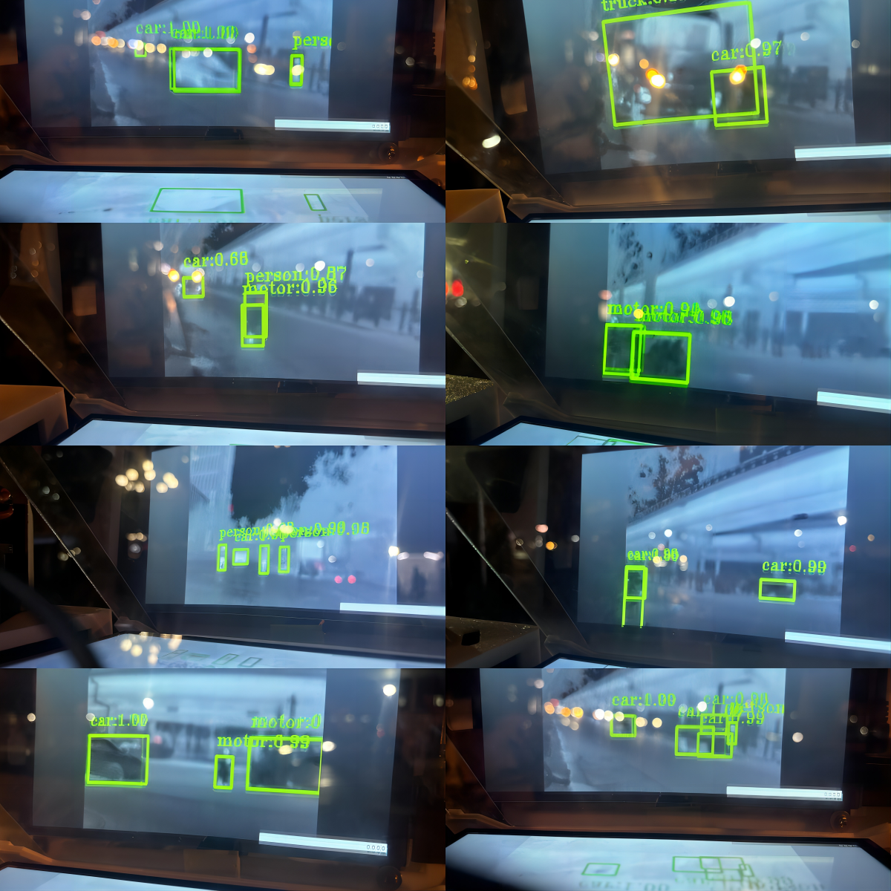

Compared to traditional threshold segmentation algorithms, deep learning-based object detection methods exhibit higher accuracy and stronger robustness. In infrared image object detection tasks, threshold segmentation algorithms are susceptible to various factors, such as the types of clothing pedestrians wear (more clothing leads to decreased recognition performance in cold weather). In contrast, algorithms based on the YOLO model are more comprehensive. They have matured to effectively address these complex scenarios, not only improving the accuracy of object detection but also enhancing the system's adaptability to diverse environmental changes.

We tested our device on real roads, and the performance of our recognition model and device is quite impressive. Here are some results from the tests we conducted on roads near our company.